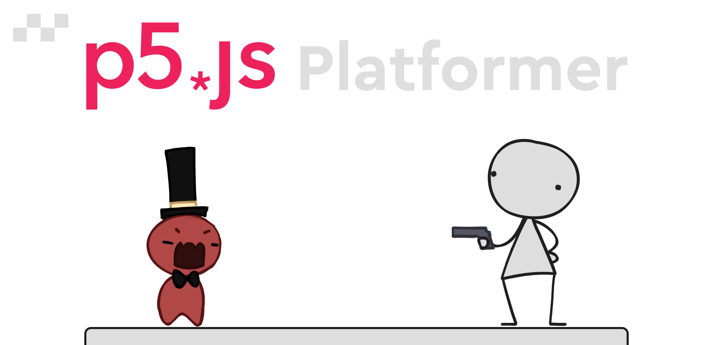

<h1 align="center"></h1>
<h4 align="center">A simple platformer game written in <a href="http://p5js.org">p5.js</a>.</h4>

You can give it a go <a href="https://squigglesdev.github.io/p5Platformer">here</a>!

Or you can read how I made it <a href="https://squigglesdev.github.io/blog/platformer">here</a>!
